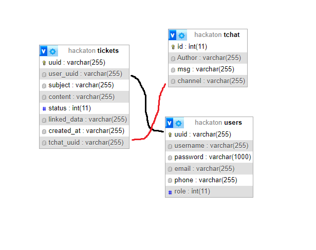

# Hackaton

## Description

App de mise en relation des citoyens et les élus locaux et de lisibilité des données publiques.
Le petit plus permettre aux élus locaux d'ajouter des datasets ou api et aux citoyennes de le suggérer.

## Stack

### Back 

Golang utilisant le framework [gin](https://www.gin-gonic.com)

Base de données pour les élus locaux et les citoyens [MySQL](https://www.mysql.com/fr/)

Base de données pour les datasets et les api [mongoDB](https://www.mongodb.com/fr)

### Front

Pour le front, nous avons utilisé [React](https://fr.reactjs.org) pour la page du tableau de bord
et pour le reste du site avec [Tailwind](https://tailwindcss.com) pour le style.

## Les pages du site

### Tableau de bord

- Affichage des datasets

[](https://gyazo.com/deb43f336840e619dea99afd6f154ede)
[](https://gyazo.com/3d82a10656f13cde6efbd1f917a5d5c1)
[](https://gyazo.com/addb29f2b3be2d60950398d4fd8552ce)
[](https://gyazo.com/0ac191bb5f91b70bc308071455c0f96c)

### Page des tickets (accès restreint aux élus locaux et aux administrateurs)

- affichage des tickets
- accès au traitement du ticket

[](https://gyazo.com/c0bb2976bfaf16fda13d58e13a2dc8ce)
[](https://gyazo.com/54d6d09a5621afe8d9f896703ddc84f2)

### Page de traitement du ticket (accès restreint aux élus locaux et aux administrateurs

- affichage du ticket
- affichage des datasets et api reliés au ticket (à voir)
- possibilité de répondre au ticket
- possibilité de fermer le ticket

Vu admin / elu :
[](https://gyazo.com/39f0cf0bfcc33203cc2044a9652715b6)

Vu citoyen (si c'est son ticket) :
[](https://gyazo.com/231cccfcd7772ce984c52d5c4842b58f)

### Création d'un ticket

- formulaire de création d'un ticket
- possibilité de lier un dataset

[](https://gyazo.com/64d72503ae768835d3bf2081d99b9482)


### Page de connexion

- formulaire de connexion

[](https://gyazo.com/98df06818fba2b5eef7ab10f4a80751e)

### Page d'inscription

- formulaire d'inscription

[](https://gyazo.com/2e780092b70899ccd6762751cb2635e9)


## Installation

### Back

#### Prérequis

- [Golang](https://golang.org/doc/install)
- [MySQL](https://dev.mysql.com/doc/mysql-installation-excerpt/5.7/en/)
- [MongoDB](https://docs.mongodb.com/manual/installation/)

#### Installation

- Cloner le projet
- Créer une base de données MySQL avec le script `hackaton.sql`
- Créer une base de données MongoDB avec le nom 'DataSets'
- Utiliser le scraper pour remplir la base de données MongoDB **Dans le dossier scraper** exécuter la commande `go run main.go`
> Le scraper sera sans doute à modifier pour qu'il fonctionne sur votre machine
- Créer un fichier `.env` à la racine du dossier back avec les variables suivantes
```
PORT=8080
DB_HOST=YOUR_DB_HOST
DB_PORT=YOUR_DB_PORT
DB_USER=YOUR_DB_USER
DB_PASSWORD=YOUR_DB_PASSWORD
DB_DATABASE=YOUR_DB_DATABASE
URI_MONGODB=YOUT_URI_MONGODB
DB_MONGODB=DataSets
```
- Exécuter la commande `go run .` à la racine du projet


## Doc Api

[Doc Api](./DocApi.md)

## Architecture BDD



## Le github Project (équivalent à Trello)

[github project](https://github.com/users/tot0p/projects/5/views/2)

## Infra

[Infra](./INFRA.md)

## Auteurs

- [Thomas Lemaitre](https://www.github.com/tot0p)
- [Sambre](https://www.github.com/sambreVan)
- [Axel Sénécal](https://www.github.com/axou89)
- [Luca Morgado](https://www.github.com/mkarten)